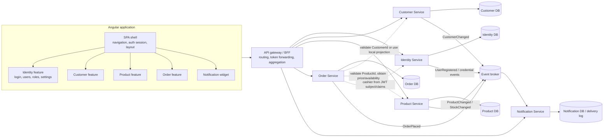

# QuickApp Monolith to Microservices Decomposition Proposal

## Executive summary

QuickApp is a layered ASP.NET Core 10 and Angular 21 monolith with one deployment unit and one SQL Server database. The recommended target is five coarse-grained services aligned to business capabilities:

1. **Identity**
2. **Customer**
3. **Product**
4. **Order**
5. **Notification**

The migration should use a strangler pattern. First establish explicit contracts and remove cross-domain object navigation inside the monolith, then extract low-dependency capabilities, and extract Order last. The Angular SPA should initially remain one deployable shell while its feature code is separated by domain; independently deployed micro-frontends should be considered only after backend routing and contracts are stable.

## Current-state module map

| Current area | Primary paths | Responsibilities | Boundary signal |
| --- | --- | --- | --- |
| Account and authorization | `QuickApp.Core/Models/Account`, `QuickApp.Core/Services/Account`, `QuickApp.Server/Controllers/User*`, `AuthorizationController` | Users, roles, permissions, login, token issuance | Strong Identity bounded context |
| Customers | `Models/Shop/Customer.cs`, `CustomerService`, `CustomerController`, `CustomerVM`, Angular `components/customers` | Customer profile and contact data | Customer aggregate exists but exposes Orders navigation |
| Products | `Models/Shop/Product*.cs`, `ProductService`, `ProductVM`, Angular `components/products` | Catalog, categories, price, inventory | Product aggregate is identifiable; implementation is mostly stubbed |
| Orders | `Models/Shop/Order*.cs`, `OrdersService`, `OrderVM`, Angular `components/orders` | Order header, lines, discounts, cashier/customer/product associations | Natural orchestration boundary with the most outbound dependencies |
| Email and notifications | `IEmailSender`, `EmailSender`, Angular `notification-*` services and viewer | SMTP delivery plus client-side demo notification feed | Notification capability is split across server email and client demo data |
| Shared persistence | `ApplicationDbContext`, migrations, `DatabaseSeeder` | Identity and all business tables, audit stamping, demo data | Main source of runtime and schema coupling |
| Shared host | `QuickApp.Server/Program.cs`, mapping profile, API pipeline | DI, security, OpenAPI, routing, SPA hosting | Single composition root and deployment unit |

### Current data ownership

| Entity or data | Current owner | Current coupling |
| --- | --- | --- |
| `ApplicationUser`, `ApplicationRole`, claims, permissions, OpenIddict records | Account area | `ApplicationUser.Orders` and `Order.Cashier` create a Shop-to-Identity database relationship |
| `Customer` | Shop area | `Customer.Orders` and eager-loading logic traverse into Order and Product |
| `Product`, `ProductCategory` | Shop area | `OrderDetail.Product` creates a transactional cross-aggregate relationship |
| `Order`, `OrderDetail` | Shop area | Foreign keys and navigation properties reach Customer, Product, and Identity |
| SMTP configuration and templates | Server host | Business callers depend directly on `IEmailSender`; no durable delivery model |
| Browser notifications | Angular SPA | Demo data is embedded in `NotificationEndpoint`; there is no backend source of truth |

## Target service map

| Service | Owns | Responsibilities | Initial contract surface | Data boundary |
| --- | --- | --- | --- | --- |
| **Identity** | Users, roles, claims, permissions, OpenIddict clients/tokens | Authentication, token issuance, user/role administration, permission catalog | User/role queries and commands; OIDC/OAuth endpoints; `UserRegistered` event | Identity database |
| **Customer** | Customer profile, contact and address data | Customer lifecycle and customer lookup | Customer CRUD/query contracts; `CustomerChanged` event | Customer database |
| **Product** | Products, categories, price and stock state | Catalog browsing, category management, price and inventory lookup | Product/category queries and commands; `ProductChanged` and inventory events | Product database |
| **Order** | Orders, order lines, discounts, immutable customer/product/cashier snapshots | Order placement and order lifecycle | Place/get/list order contracts; `OrderPlaced` event | Order database |
| **Notification** | Delivery requests, templates and optional delivery log | Email/in-app delivery, retries, preferences, event-to-message translation | Send/query-delivery contracts; consumes integration events | Notification database or durable queue/log |

### Ownership rules

- A service is the only writer of its owned data.
- Cross-service identifiers are scalar values, never ORM navigation properties.
- Order stores the commercial facts used at purchase time: product name, unit price, customer display data, and cashier display data as required for audit.
- Services do not reference another service's implementation project or persistence model.
- Integration events are versioned contracts. They are not shared entity assemblies.
- JWT subject and permission claims are the runtime identity contract; business services validate tokens but do not query Identity for every request.

## Target dependency diagram

## Coupling analysis

### High-risk coupling

| Coupling point | Evidence | Why it blocks extraction | Proposed break |
| --- | --- | --- | --- |
| One `ApplicationDbContext` owns Identity and Shop tables | `ApplicationDbContext` derives from `IdentityDbContext` and exposes all five business `DbSet`s | Schema changes, transactions and migrations are released together | Introduce one context/schema per bounded context, followed by database-per-service |
| Order has ORM relationships to three service candidates | `Order.Customer`, `Order.Cashier`, `OrderDetail.Product` | A separate Order database cannot enforce or load these foreign keys | Keep IDs and immutable snapshots; use API checks, local projections, and events |
| Customer queries materialize an object graph across domains | `CustomerService.GetAllCustomersData` includes Orders, OrderDetails, Product and Cashier | Customer service would become a distributed join coordinator | Return customer-owned data only; create an Order-facing read model or BFF composition for customer history |
| Shared seeding creates a connected graph in one transaction | `DatabaseSeeder.SeedDemoDataAsync` creates users, customers, products and orders | Independent databases cannot use one object graph or transaction | Give each service idempotent seed data and use stable external IDs for integration fixtures |
| Identity is both token issuer and shared entity model | OpenIddict and ASP.NET Identity run in `QuickApp.Server`; `ApplicationUser` is referenced by Shop | Business services become coupled to Identity persistence and release cadence | Identity remains issuer; other services validate JWTs and retain only scalar user IDs/snapshots |

### Medium-risk coupling

| Coupling point | Risk | Proposed break |
| --- | --- | --- |
| `BaseEntity`, `IAuditableEntity`, and `IUserIdAccessor` are shared across all data | A shared runtime package can recreate monolith release coupling | Duplicate the small audit convention per service or use a carefully versioned build-time template; read actor ID from claims |
| `MappingProfile` maps every domain in one assembly | Every DTO/model change updates the host | Keep mapping inside each service; public contracts remain explicit and independently versioned |
| All DI registration lives in `Program.cs` | Composition changes require monolith deployment | Each service owns a composition root; gateway owns routing only |
| SPA uses one global `ConfigurationService` and `EndpointBase` | Feature code assumes one base URL and one token-refresh mechanism | Shell provides auth and API client primitives; domain clients receive gateway-relative endpoints |
| Notification behavior is split between SMTP and in-memory Angular demo data | No durable backend contract or ownership | Create Notification contracts and backend delivery abstraction; replace demo endpoint incrementally |

### Coupling that should remain centralized

- Token issuance, credential validation, roles and permission definitions belong in Identity.
- SPA session state, login redirect handling, token refresh and top-level navigation belong in the shell.
- External API routing, cross-cutting headers, correlation IDs and rate limiting belong in the gateway/BFF.
- Observability conventions should be consistent across services, but implementation packages must be independently upgradeable.

## Angular SPA decomposition strategy

### Recommended sequence

1. **Create domain feature boundaries while retaining one deployable SPA.**
   - Move routes, components, domain models and domain API clients into `features/identity`, `features/customer`, `features/product`, `features/order`, and `features/notification`.
   - Keep `core/` for singleton shell concerns: auth session, route guards, configuration, error handling and HTTP interceptors.
   - Keep `shared/` limited to presentational components, pipes and directives with no business API calls.
2. **Route all feature API calls through gateway-relative domain clients.**
   - Replace direct assumptions about one server base URL with `/api/identity`, `/api/customers`, `/api/products`, `/api/orders`, and `/api/notifications`.
   - Preserve one token refresh implementation in the shell.
3. **Align route ownership with backend extraction.**
   - `login`, user/role controls and settings are Identity-owned.
   - `customers`, `products` and `orders` map to their same-named services.
   - The notification viewer is shell-mounted but backed by Notification.
4. **Add contract and consumer tests before independent deployment.**
   - Validate gateway routes and DTO compatibility for each feature.
   - Avoid sharing generated clients between unrelated features unless they are generated from versioned OpenAPI documents.
5. **Adopt micro-frontends only when deployment independence is valuable.**
   - Start with route-level lazy loading because the current feature pages are small and mostly placeholders.
   - If teams require separate release cadence, convert domain feature folders into Module Federation remotes or separately built Angular applications mounted by the shell.
   - Identity session handling, shell layout, design tokens and observability remain host-owned.

### SPA dependency rules

- Feature code may depend on `core` abstractions and `shared` presentation utilities.
- `core` and `shared` must not import a feature.
- One feature must not import another feature's state or API client.
- Cross-feature screens use a BFF/read model rather than browser-side fan-out where consistency or latency matters.
- Notification receives events from backend services; it does not inspect another feature's local state.

## Phased migration plan

### Phase 0: decomposition POC and guardrails

- Establish `modernization-poc` as the integration base.
- Add this proposal and service-specific implementation prompts.
- Create standalone service and contract skeletons without deleting monolith code.
- Require passing unit tests and no references between service implementation projects.

**Exit criteria:** five skeleton PRs demonstrate compile-time boundaries and expose the coupling decisions that still need architecture review.

### Phase 1: modularize inside the monolith

- Remove Customer-to-Order collection loading from customer-owned queries.
- Replace Order navigation dependencies with IDs and snapshot fields behind existing interfaces.
- Split mappings, DI registration and data access into domain modules.
- Introduce versioned in-process domain events and an outbox-compatible event interface.
- Add characterization tests around login, customer lookup, catalog lookup and order placement.

**Exit criteria:** domain modules can be tested independently and no domain requires another domain's ORM entities.

### Phase 2: extract Notification, Customer and Product

- Extract Notification first because the current SMTP capability is largely stateless.
- Extract Customer and Product behind gateway routes.
- Use change-data backfill plus dual-read comparison before switching reads.
- Use an outbox and idempotent consumers before asynchronous integration is enabled.

**Exit criteria:** the monolith no longer writes Customer/Product/Notification-owned data.

### Phase 3: extract Identity

- Move ASP.NET Identity, OpenIddict, authorization administration and token endpoints to Identity.
- Configure the gateway and all resource services to validate Identity-issued JWTs.
- Preserve token claims and endpoint compatibility during cutover.
- Remove business-domain navigation from `ApplicationUser`.

**Exit criteria:** the monolith is no longer a token issuer and business services have no Identity database access.

### Phase 4: extract Order

- Finalize Customer and Product validation/lookup contracts.
- Persist immutable order-line price/name snapshots and customer/cashier audit snapshots.
- Implement order placement with explicit failure handling; use a saga only where compensating work is required.
- Publish `OrderPlaced` through an outbox for Notification and downstream consumers.

**Exit criteria:** Order is the sole writer of order data and has no distributed database transaction.

### Phase 5: frontend deployment independence and retirement

- Switch each route to extracted service endpoints through the gateway.
- Replace Angular demo notifications with Notification APIs.
- Measure whether separate frontend deployment cadence justifies micro-frontends.
- Retire remaining monolith endpoints, tables and SPA host responsibilities after traffic and data reconciliation.

## Migration controls

- **Contract versioning:** additive changes by default; breaking changes require a new endpoint/event version.
- **Data migration:** backfill, reconcile, shadow-read, cut over writes, then remove old ownership.
- **Reliability:** transactional outbox, idempotency keys, retry budgets and dead-letter handling.
- **Security:** Identity issues tokens; services enforce audience, issuer, scopes/permissions and least privilege.
- **Observability:** propagate correlation and causation IDs through HTTP and events.
- **Testing:** characterization tests, contract tests, service unit tests, integration tests and cutover smoke tests.
- **Rollback:** keep gateway routing switches and old read paths available until reconciliation passes.

## Manual architecture review flags

1. **Order consistency:** decide whether order placement reserves inventory synchronously, asynchronously, or not at all in this POC.
2. **Snapshot policy:** approve which Customer, Product and cashier fields become immutable order snapshots.
3. **Identity boundary:** decide whether user profile/preferences stay in Identity or move to a separate profile capability later.
4. **Permission ownership:** confirm whether Product/Customer/Order permission names are centrally registered by Identity or federated from service manifests.
5. **Notification semantics:** decide whether Notification owns user delivery preferences and durable in-app notifications in addition to email.
6. **Gateway composition:** identify screens that need BFF read models instead of multiple browser calls.
7. **Frontend deployment model:** delay Module Federation until team ownership and release-independence requirements are explicit.
8. **Data cutover:** select a migration method for SQL Server tables and define reconciliation thresholds.

## Reusable modernization playbook candidate

This POC can be generalized across similar repositories using the following repeatable workflow:

1. Inventory deployables, data stores, entry points, entities, APIs, UI routes and background jobs.
2. Cluster code by business capability and assign exactly one proposed data owner.
3. Build a dependency graph from database relationships, service calls, shared libraries and UI imports.
4. Score coupling by data ownership, transaction scope, runtime call frequency and change cadence.
5. Select coarse boundaries and define scalar IDs, snapshots, APIs and events at every boundary.
6. Draft a strangler sequence that extracts leaf capabilities before orchestrators.
7. Generate one self-contained implementation prompt per candidate service with explicit anti-coupling rules.
8. Run parallel skeleton extractions, then aggregate PRs and unresolved coupling decisions.
9. Add characterization, contract and migration tests before moving production behavior or data.
10. Feed outcomes, exceptions and review decisions back into a parameterized Devin playbook.

Parameters for a scalable playbook should include repository, base branch, technology stack, target service names, required project naming, data-store strategy, frontend architecture, test commands and PR policy. The playbook should require human approval for service ownership, distributed transaction design, security boundaries and irreversible data cutover.

## POC extraction results

| Service | Extraction PR | Key owned entities/capabilities | Coupling points requiring review |
| --- | --- | --- | --- |
| Identity | [PR #12](https://github.com/CitiusTech-Test/quickapp-monolith/pull/12) | `ApplicationUser`, `ApplicationRole`, `ApplicationPermission`, credentials, claims, OpenIddict token issuance | `Order.Cashier`; shared `ApplicationDbContext`; audit actor claims; centralized permission registration |
| Customer | [PR #9](https://github.com/CitiusTech-Test/quickapp-monolith/pull/9) | `Customer` profile, contact and address data | `Customer.Orders`; eager Customer-to-Order/Product/Cashier graph; `CustomerVM.Orders`; direct email call; shared context/seeder/mapping |
| Product | [PR #8](https://github.com/CitiusTech-Test/quickapp-monolith/pull/8) | `Product`, `ProductCategory`, catalog, price and inventory lookup | `OrderDetail.Product`; checkout price/inventory consistency; shared context and seeding |
| Order | [PR #11](https://github.com/CitiusTech-Test/quickapp-monolith/pull/11) | `Order`, `OrderDetail`, lifecycle, line and customer/product/cashier snapshots | Customer/Product lookup adapters; snapshot policy; inventory reservation; durable `OrderPlaced`; no distributed transaction |
| Notification | [PR #10](https://github.com/CitiusTech-Test/quickapp-monolith/pull/10) | Delivery requests/status, channels, templates, recipient model and in-app records | SMTP adapter; durable retries; preferences; event schema ownership; replacement of Angular demo data |

All five PRs are additive, target `modernization-poc`, and include passing unit tests. They deliberately do not rewire the monolith.

### Integration warning

Every extraction PR updates `QuickApp.sln`. Each PR is independently mergeable against the current base, but merging one changes the shared solution file and may create clerical conflicts for the remaining PRs. Reconcile all distinct project entries and configuration rows rather than choosing one side wholesale.
