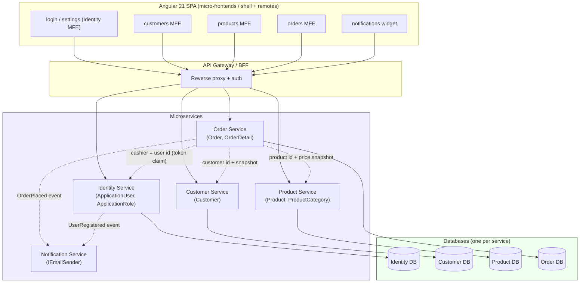

# QuickApp Monolith → Microservices Decomposition Proposal

> Status: **POC / planning**. This document proposes a coarse-grained decomposition of the
> `QuickApp` monolith (ASP.NET Core 10 + Angular 21, EF Core, single SQL Server database)
> into five candidate microservices and describes a phased, strangler-fig migration.

## 1. Current Architecture (as-is)

QuickApp is a classic layered monolith:

- **`QuickApp.Core`** — domain models (`Account/*`, `Shop/*`), service interfaces/implementations, and a single `ApplicationDbContext` (an `IdentityDbContext`).
- **`QuickApp.Server`** — ASP.NET Core host: controllers, ViewModels, AutoMapper profiles, OpenIddict/OAuth2 auth, EF migrations.
- **`quickapp.client`** — Angular 21 SPA with feature areas: `login`, `settings` (users/roles), `customers`, `orders`, `products`, plus a `notification` service.

All modules share:
- **One database** (`ApplicationDbContext`) — Identity tables + `AppCustomers`, `AppProducts`, `AppProductCategories`, `AppOrders`, `AppOrderDetails`.
- **A shared kernel** — `BaseEntity` / `IAuditableEntity` (audit stamping via `AddAuditInfo`, which reads the current user id through `IUserIdAccessor`).
- **One deployment unit** and one OAuth2 authority (OpenIddict inside `QuickApp.Server`).

### Domain entities and ownership today

| Entity | Table | Notes |
|--------|-------|-------|
| `ApplicationUser` / `ApplicationRole` / claims | ASP.NET Identity tables | Auth + user/role management |
| `Customer` | `AppCustomers` | Shop customer profile |
| `Product` / `ProductCategory` | `AppProducts`, `AppProductCategories` | Catalog, self-referencing `Parent`/`Children` |
| `Order` / `OrderDetail` | `AppOrders`, `AppOrderDetails` | Sales; FK to `Customer`, `Product`, and `ApplicationUser` (cashier) |
| Email (`IEmailSender`) | — (SMTP via MailKit) | Outbound notification, no persistence |

## 2. Candidate Services (target)

Coarse-grained, aligned to business capabilities:

| Service | Owns (entities / tables) | Responsibility | Public contract (illustrative) |
|---------|--------------------------|----------------|--------------------------------|
| **Identity** | `ApplicationUser`, `ApplicationRole`, Identity claim/role tables, permissions | Authentication (OAuth2/OIDC issuer), user & role management, permission catalog | `IUserAccountService`, `IUserRoleService`; issues JWTs; exposes `GET /users`, `GET /roles` |
| **Customer** | `Customer` (`AppCustomers`) | Customer profiles, addresses, contact info | `ICustomerService`: `GetAllCustomersData`, `GetTopActiveCustomers`; `GET/POST/PUT/DELETE /customers` |
| **Product** | `Product`, `ProductCategory` (`AppProducts`, `AppProductCategories`) | Catalog, categories, pricing, stock levels | `IProductService`; `GET/POST/PUT/DELETE /products`, `/categories` |
| **Order** | `Order`, `OrderDetail` (`AppOrders`, `AppOrderDetails`) | Order lifecycle, line items, totals/discounts | `IOrdersService`; `GET/POST /orders`; consumes Customer, Product, Identity |
| **Notification** | (stateless; optional `NotificationLog`) | Outbound email/notifications, templating | `IEmailSender`: `SendEmailAsync(...)`; subscribes to domain events |

Each service becomes its own deployable with its **own** database schema (database-per-service). The shared `BaseEntity`/`IAuditableEntity` audit contract is duplicated per service (small, stable) rather than shared as a runtime dependency.

## 3. Service Map

## 4. Coupling Points That Must Be Broken

These are the hard dependencies in today's code that block a clean split:

1. **`Order.CashierId` / `Order.Cashier` → `ApplicationUser`** (FK from Shop to Identity).
   - *Break by*: store cashier as an opaque `CashierUserId` string sourced from the JWT `sub` claim; drop the navigation property and cross-schema FK. Resolve display names via Identity API/token claims, not a DB join.
2. **`Order.CustomerId` / `Order.Customer` → `Customer`** (FK Order → Customer).
   - *Break by*: keep `CustomerId` as a value; validate existence via Customer service at order creation; optionally snapshot customer name/email onto the order.
3. **`OrderDetail.ProductId` / `OrderDetail.Product` → `Product`** (FK Order → Product).
   - *Break by*: keep `ProductId` + **price/name snapshot** on `OrderDetail` (already has `UnitPrice`); no runtime FK to Product DB.
4. **Single `ApplicationDbContext`** across all aggregates.
   - *Break by*: one `DbContext` + schema per service; no cross-context transactions. Use eventual consistency / sagas for multi-service workflows (e.g. order placement).
5. **`AddAuditInfo` depends on `IUserIdAccessor` (Identity)** for `CreatedBy`/`UpdatedBy`.
   - *Break by*: each service reads the user id from the incoming token (gateway-forwarded claim), not a shared Identity component.
6. **Shared kernel `BaseEntity`/`IAuditableEntity`.**
   - *Break by*: copy the tiny contract into each service; do not share a runtime library that couples release cycles.
7. **Single OAuth2 authority (OpenIddict in `QuickApp.Server`).**
   - *Break by*: Identity service becomes the sole token issuer; other services are resource servers validating JWTs.
8. **Angular monolithic SPA** with a shared `endpoint-base.service` and global auth.
   - *Break by*: split into feature MFEs (or a shell + lazy remotes) with a BFF/gateway; keep shared auth/token-refresh in the shell.

## 5. Phased Migration (strangler fig)

**Phase 0 — Guardrails (this POC).**
Create the `modernization-poc` branch. Stand up a standalone project skeleton per service (interface contracts + stub + unit tests) without removing monolith code. *(Delivered by the child sessions.)*

**Phase 1 — Decouple within the monolith.**
- Replace cross-aggregate navigation FKs (`Order→Customer/Product/User`) with plain id values + snapshots.
- Split `ApplicationDbContext` into per-schema contexts behind the service interfaces.
- Introduce a domain-event abstraction (`OrderPlaced`, `UserRegistered`) consumed by an in-process Notification handler.

**Phase 2 — Extract leaf services first.**
- **Notification** (stateless, no inbound deps) and **Product** / **Customer** (own data, few callers) are extracted first behind the gateway.
- Point the SPA/gateway routes at the new services one capability at a time.

**Phase 3 — Extract Identity as the auth authority.**
- Move OpenIddict issuer into the Identity service; other services become resource servers.

**Phase 4 — Extract Order last.**
- Order depends on all others; extract once Customer/Product/Identity contracts are stable. Implement order placement as a saga (validate customer, reserve/lookup product price, record cashier from token, emit `OrderPlaced`).

**Phase 5 — Frontend decomposition.**
- Break the Angular SPA into a shell + feature remotes (Identity/settings, Customers, Products, Orders) with a BFF per surface; retire the monolith host.

## 6. Deliverables of this POC

- This proposal (service map + mermaid diagram + coupling analysis).
- One child session per service — each extracts a standalone project skeleton (`QuickApp.<Service>.Service` + `QuickApp.<Service>.Contracts`), interface contract, stub implementation, and unit tests, and opens its own PR into `modernization-poc`.
- Orchestrator aggregates the child PRs and flags the cross-service coupling above for manual review.
